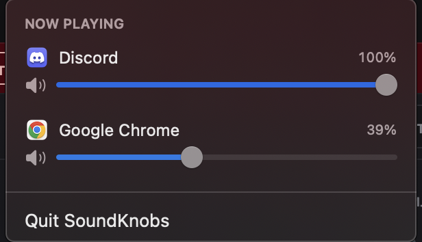

# SoundKnobs

**Per-app volume control for macOS.** A tiny menu-bar mixer: every app currently
playing audio gets its own row with an icon, a volume slider, and a mute button —
and the sliders genuinely change that app's volume, independently of everything else.



Built on the public Core Audio **process tap** API — no kernel driver, no system
extension, nothing installed system-wide. Quit the app and every audio path
returns to normal instantly.

## Install (no building required)

1. **[Download SoundKnobs.zip](https://github.com/valeriy777-ua/SoundKnobs/releases/latest/download/SoundKnobs.zip)** from the latest release.
2. Unzip it and drag **SoundKnobs.app** into your **Applications** folder.
3. Open it. macOS will block the first launch (the app isn't notarized) — go to
   **System Settings → Privacy & Security**, scroll down, and click **"Open Anyway"**.
   *(Terminal alternative: `xattr -dc /Applications/SoundKnobs.app`)*
4. Click the slider icon in the menu bar. The **first time you move a slider**,
   macOS asks for **System Audio Recording** permission — approve it, then move
   the slider again.

Requires **macOS 14.4 or newer** (Sonoma 14.4 / Sequoia). Universal binary —
Apple Silicon and Intel.

## Features

- Live list of every app currently playing audio, with real per-app volume sliders
- Per-app mute
- Helper processes grouped under their parent app (Chrome shows as one row)
- Follows your default output device automatically (speakers ↔ headphones)
- Sliders are lazy: audio is untouched until you actually adjust an app

## Why the audio-recording permission?

Per-app volume doesn't exist as a macOS feature, so SoundKnobs uses Apple's
Core Audio *process taps*: it taps an app's audio stream, scales the samples to
your chosen volume, and plays them out. The OS classifies that tap as "system
audio recording" — but nothing is recorded or stored, and the tap only exists
for apps whose slider you've moved.

## Known limitations

- Volumes aren't persisted across launches yet
- Per-tab browser control is impossible at the OS level (browsers mix all tabs
  into one stream before macOS sees it) — use a per-tab extension alongside
- Per-app output routing (app → specific device) is not implemented yet

## Build from source

```bash
git clone https://github.com/valeriy777-ua/SoundKnobs.git
cd SoundKnobs
./build.sh
open build/SoundKnobs.app
```

Requires Xcode or the Command Line Tools (`xcode-select --install`).

## License

MIT
